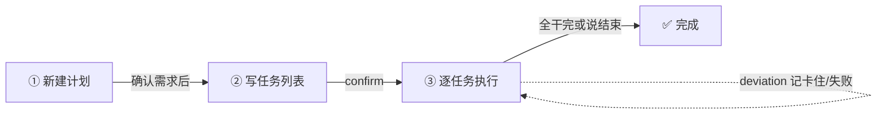

# dsh-plan-execute


**让 DeepSeek Harness 帮你「先想清楚 → 列好计划 → 干完验收」。说一句「计划实施」就开工。**

## 它能干什么

做项目最怕两件事：**没想清楚就动手**，和**干到一半忘了当初怎么定的**。这个插件把「问清楚 → 写计划 → 干活验收」串成一条龙：

1. **先问清楚** —— 像面试官一样，把需求、风险、假设逐条问透；
2. **再写计划** —— 把确认好的决定写成一份清晰的计划；
3. **最后干完验收** —— 照着计划一条条执行、验收，进度实时记下来。

几个贴心的地方：

- ⏸️ **随时能停**：所有记录都存成文件，下次说「继续」接着干，不会从头再来；
- 🤝 **能交给别人**：计划是普通文本文件，可以直接甩给别的 agent 或同事接着做；
- 🛡️ **不会乱动你的东西**：开工前先跟你确认目录和项目名，发现同名旧计划会先问你，绝不悄悄覆盖；
- 🇨🇳 **全程中文**。

## 安装

```bash
dsh plugin --profile web add github:leotangjc/plan-execute
```

> `--profile` 填你实际用的 profile（`web` / `tui` / 自定义名）。装完**重启 DSH**，就能用了。

**GitHub 直连不通时（大陆网络）**，镜像 clone 到本地再装：

```bash
git clone --depth 1 https://ghfast.top/https://github.com/leotangjc/plan-execute.git && cd plan-execute
dsh plugin --profile web add .
```

> `ghfast.top` 这类镜像域名会不定期失效，克隆失败就换任意可用的 GitHub 加速镜像，命令结构不变。

> 装完**保留这个 clone 目录**：本地安装是 `file:` 依赖，删了插件就断，也不会像 `add github:...` 那样自动升级（想升级就重新 clone + 重新 add）。

### ⚠️ 安装可能踩的三个坑（实测）

1. **被沙箱拦住**：`dsh plugin add` 要写 `~/.dsh/profiles/`（在你的工作目录之外），首次可能报 `EPERM` 或 `file access denied`。用 `danger-full-access` 权限重跑同一条命令即可。
2. **pnpm 白名单**：如果提示 `git-hosted plugins build … which pnpm blocks until allowed`，去 `~/.dsh/profiles/<name>/pnpm-workspace.yaml` 的 `allowBuilds` 下按提示加一条 key。注意这 key 带 commit 号，**升级后要重新加**。
3. **装完要重启 `dsh web`**：正在跑的界面不会自动加载新代码，不重启看不到变化。

## 怎么用

两种方式进入流程：

- **直接说**：「计划实施」「编译计划」「执行计划」
- **默认触发**：提出需求模糊、多步骤或项目级的新任务时，它会先进入流程跟你确认需求再动手；简单明确的事（查资料、改个小文件）不打扰你。

想跳过流程直接做，说「直接做 / 不用确认」即可。

流程长这样：



一次对话大概长这样：

```
你：计划实施
它：【编译计划】已新建计划「proj」。请确认任务列表。
你：建页面、接接口、写测试
它：（把任务列表写进 proj.md）确认后开始执行？
你：开始
它：【执行验收】开始（3 个任务）……
你：（逐任务执行）
它：T1 干完了 → 把 proj.md 里 [ ] 改成 [x]
你：进度
它：【进度】2/3 完成 - 已完成：T1、T3 - 未完成：T2 - blocked：T2 等上游
你：结束
它：【收尾闸门】还有 1 个任务未标记完成：T2（接接口）。若确实完成了请勾选，若放弃了先记 deviation。
```

## 记录存在哪

所有记录都落在**你开会话的那个目录**里，是普通文本，谁都能接着看：

```
<你的工作目录>/
├── proj.md                # 计划 + 执行进度（任务勾选行 - [x] T1: 标题 = 状态真相）
└── .plan/
    └── proj.meta.json     # 内部用：阶段指针 + 偏差列表（引擎写，别手改）
```

> **想看重不重要**：任务干到哪了，打开 `proj.md` 扫一眼勾选行就知道——`[x]` 是干完的，`[ ]` 是没干的。这就是状态真相，不依赖引擎报告。
> 项目名建议用 ASCII（拼音/编号）。每次驱动工具都记得带 slug。

## 常见问题

**Q：工具名为什么是英文 `plan_execute`？**
A：平台规定工具名只能是英文字母、数字、下划线、连字符，中文名会直接报错。但你说话照常用中文就行。

**Q：它和「对话」是什么关系？会不会抢着替我做决定？**
A：不会。它有一套硬规矩：**逐题等你回答、绝不替你拍板**。每个决定都会先问你，你说什么它记什么。

**Q：需要装 Node 吗？**
A：不用。装好的包里已经带成品，只有你要改代码重新构建时才需要 Node。

## 两种工作模式（轻重并存）

同一个插件内置两套引擎，用组合行 `config.mode` 切换（改完重启 DSH 生效）：

| | **light（缺省）** | **heavy** |
|---|---|---|
| 适合 | 普通用户、个人项目 | 重度项目管理、要审计 |
| 状态真相 | `<slug>.md` 勾选行（`- [x] T1: 标题`） | meta 快照 + md 展示（完整状态机） |
| 流程 | start → 写任务列表 → confirm → 执行 → stop | grill 拷问 → compile 两层确认 → execute → done |
| 文件 | `proj.md` + `.plan/proj.meta.json` | `.grill/` + `.plan/`（md + meta + 指针 + 日志） |
| 动作 | start/confirm/deviation/report/stop/continue | start/answer/continue/report/stop |

```yaml
# ~/.dsh/.agent-presets/<你的preset>/agent.cordis.yml 里的插件行
- id: tool-plan-execute
  name: './plan-execute/lib/index.js'
  config:
    mode: heavy        # light（缺省）或 heavy
    autoTrigger: true
```

> 两种模式工具名/触发词相同（`plan_execute` / 「计划实施」），只是行为深浅不同。**切模式后旧计划互不可见**（文件契约不同），建议切换时换 slug 或目录。

## 已知限制

- 它负责「闸门与统计」，**不负责替你想**——问什么、任务怎么写、验收怎么判，由它驱动的 agent 来做（但都以你的决定为准）；
- 「默认触发」靠模型判断，偶尔可能漏触发（复杂任务没进流程）或过度触发（简单任务被多问几句）——说「直接做」可随时跳过，或用触发词显式进入；也可在插件配置里设 `autoTrigger: false` 改回「仅触发词」模式；
- 任务状态以 `proj.md` 勾选行为准：agent 干完任务会改 `[x]`，**忘改的话进度报告会少一项、收尾时会被拦住**——不会静默漏掉（这是设计，不是 bug）；
- 干失败/卡住的任务：不改勾选，用 deviation 记（`failed: T1 原因` / `blocked: T2 原因`），报告会显示；
- 同一计划同时只在一个会话跑（两个会话会互相覆盖 md）；
- 没有「撤销/回滚」；想留历史，建议把你的工作目录放进 git；
- 记录只在你开会话的目录里可靠，别把路径配到工作区外。

## 开发者

```bash
npm install      # 装依赖
npm test         # 跑测试（20 个用例）
npm run build    # 重新编译（改完代码记得提交新产物）
```

想了解内部结构，看 [`ARCHITECTURE.md`](./ARCHITECTURE.md)。协议：[MIT](./LICENSE)。
