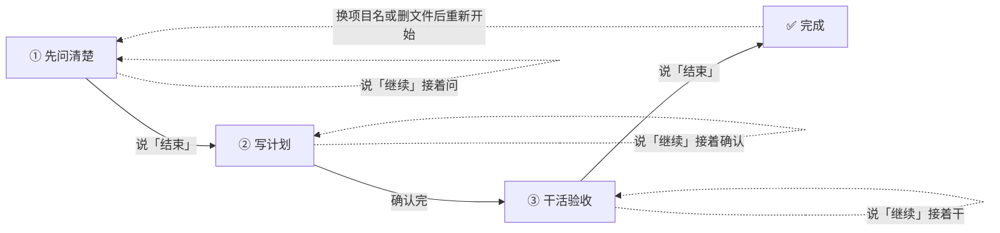

# dsh-plan-execute


**让 DeepSeek Harness 帮你「先想清楚 → 列好计划 → 干完验收」。说一句「计划实施」就开工。**

## 它能干什么

做项目最怕两件事：**没想清楚就动手**，和**干到一半忘了当初怎么定的**。这个插件把「问清楚 → 写计划 → 干活验收」串成一条龙：

1. **先问清楚** —— 像面试官一样，把需求、风险、假设逐条问透；
2. **再写计划** —— 把确认好的决定写成一份清晰的计划；
3. **最后干完验收** —— 照着计划一条条执行、验收，进度实时记下来。

几个贴心的地方：

- ⏸️ **随时能停**：所有记录都存成文件，下次说「继续」接着干，不会从头再来；
- 🤝 **能交给别人**：计划是普通文本文件，可以直接甩给别的 agent 或同事接着做；
- 🛡️ **不会乱动你的东西**：开工前先跟你确认目录和项目名，发现同名旧计划会先问你，绝不悄悄覆盖；
- 🇨🇳 **全程中文**。

## 安装

```bash
dsh plugin --profile web add github:leotangjc/plan-execute
```

> `--profile` 填你实际用的 profile（`web` / `tui` / 自定义名）。装完**重启 DSH**，就能用了。

**GitHub 直连不通时（大陆网络）**，镜像 clone 到本地再装：

```bash
git clone --depth 1 https://ghfast.top/https://github.com/leotangjc/plan-execute.git && cd plan-execute
dsh plugin --profile web add .
```

> `ghfast.top` 这类镜像域名会不定期失效，克隆失败就换任意可用的 GitHub 加速镜像，命令结构不变。

> 装完**保留这个 clone 目录**：本地安装是 `file:` 依赖，删了插件就断，也不会像 `add github:...` 那样自动升级（想升级就重新 clone + 重新 add）。

### ⚠️ 安装可能踩的三个坑（实测）

1. **被沙箱拦住**：`dsh plugin add` 要写 `~/.dsh/profiles/`（在你的工作目录之外），首次可能报 `EPERM` 或 `file access denied`。用 `danger-full-access` 权限重跑同一条命令即可。
2. **pnpm 白名单**：如果提示 `git-hosted plugins build … which pnpm blocks until allowed`，去 `~/.dsh/profiles/<name>/pnpm-workspace.yaml` 的 `allowBuilds` 下按提示加一条 key。注意这 key 带 commit 号，**升级后要重新加**。
3. **装完要重启 `dsh web`**：正在跑的界面不会自动加载新代码，不重启看不到变化。

## 怎么用

两种方式进入流程：

- **直接说**：「计划实施」「拷问决策」「编译计划」「执行计划」「跑计划」
- **默认触发**：提出需求模糊、多步骤或项目级的新任务时，它会先进入「拷问决策」跟你确认需求再动手；简单明确的事（查资料、改个小文件）不打扰你。

想跳过流程直接做，说「直接做 / 不用确认」即可。流程里说「结束」进入下一阶段，说「暂停 / 停」停留在当前阶段（未决问题会记进 Unresolved Backlog）。

它会自动走完三个阶段：



一次对话大概长这样：

```
你：计划实施
它：【拷问决策】开始。（读代码后逐题问你）
你：（逐题回答）……
你：结束                 ← 自动进入下一步
它：【编译计划】先确认结构……
你：结构 OK
它：再确认细节……
你：任务列表 OK，验收标准 OK
它：【执行验收】开始。……
你：（逐个执行任务）
它：已记录：T1 → done
你：报告                 ← 想看进度就说「报告」
它：【里程碑报告】- done: 1 - failed: 1（T2: 测试挂了）……
```

## 记录存在哪

所有记录都落在**你开会话的那个目录**里，是普通文本，谁都能接着看：

```
<你的工作目录>/
├── .grill/<项目名>.md       # 第 1 步：问清楚的记录（问答）
└── .plan/
    ├── <项目名>.md          # 第 2、3 步：计划 + 执行进度
    └── <项目名>.meta.json   # 内部用：记住走到哪一步了（别手改）
```

> 项目名建议用 ASCII（拼音/编号）；纯中文名会自动转成 `plan-短哈希`（不会互相覆盖，但文件名不那么好认）。

## 常见问题

**Q：工具名为什么是英文 `plan_execute`？**
A：平台规定工具名只能是英文字母、数字、下划线、连字符，中文名会直接报错。但你说话照常用中文就行。

**Q：它和「对话」是什么关系？会不会抢着替我做决定？**
A：不会。它有一套硬规矩：**逐题等你回答、绝不替你拍板**。每个决定都会先问你，你说什么它记什么。

**Q：需要装 Node 吗？**
A：不用。装好的包里已经带成品，只有你要改代码重新构建时才需要 Node。

## 已知限制

- 它负责「记」和「推进流程」，**不负责替你想**——问什么、计划怎么写、验收怎么判，由它驱动的 agent 来做（但都以你的决定为准）；
- 「默认触发」靠模型判断，偶尔可能漏触发（复杂任务没进流程）或过度触发（简单任务被多问几句）——说「直接做」可随时跳过，或用触发词显式进入；也可在插件配置里设 `autoTrigger: false` 改回「仅触发词」模式；
- 说「暂停 / 停」只停留在当前阶段（不推进），未决问题进 Unresolved Backlog；说「结束 / 够了」才进入下一阶段，且进入编译前未决项必须处理完（否则会被暂缓一次）；
- 「执行状态」节由工具用 record 写、别手改（里程碑报告按它统计）；计划六字段、确认记录、偏差记录可正常编辑；
- 没有「撤销/回滚」；想留历史，建议把你的工作目录放进 git；
- 记录只在你开会话的目录里可靠，别把路径配到工作区外。

## 开发者

```bash
npm install      # 装依赖
npm test         # 跑测试（18 个用例）
npm run build    # 重新编译（改完代码记得提交新产物）
```

想了解内部结构，看 [`ARCHITECTURE.md`](./ARCHITECTURE.md)。协议：[MIT](./LICENSE)。
