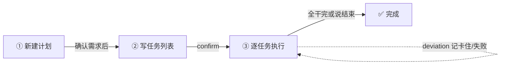

# dsh-plan-execute 完整介绍

> 版本 0.1.0 · MIT · [github.com/leotangjc/plan-execute](https://github.com/leotangjc/plan-execute)
> 本文档是完整版介绍；README 是简介版。想了解内部设计，见 ARCHITECTURE.md。

**让 DeepSeek Harness 帮你「先想清楚 → 列好计划 → 干完验收」。说一句「计划实施」就开工。**

---

## 目录

1. [它解决什么问题](#1-它解决什么问题)
2. [核心设计：状态真相不撒谎](#2-核心设计状态真相不撒谎)
3. [两种工作模式（轻重并存）](#3-两种工作模式轻重并存)
4. [安装](#4-安装)
5. [light 模式使用指南](#5-light-模式使用指南)
6. [heavy 模式使用指南](#6-heavy-模式使用指南)
7. [文件契约](#7-文件契约)
8. [常见问题](#8-常见问题)
9. [已知限制](#9-已知限制)
10. [开发者指南](#10-开发者指南)
11. [版本历史](#11-版本历史)

---

## 1. 它解决什么问题

做项目最怕两件事：**没想清楚就动手**，和**干到一半忘了当初怎么定的**。

这个插件把「问清楚 → 写计划 → 干活验收」串成一条龙，并把每步的决定**落成文件**，让「想清楚」和「干完验收」不是口号而是可检查的过程：

1. **先问清楚** —— 像面试官一样，把需求、风险、假设逐条问透；
2. **再写计划** —— 把确认好的决定写成一份清晰的计划；
3. **最后干完验收** —— 照着计划一条条执行、验收，进度实时记下来。

几个贴心的地方：

- ⏸️ **随时能停**：所有记录都存成文件，下次说「继续」接着干，不会从头再来；
- 🤝 **能交给别人**：计划是普通文本文件，可以直接甩给别的 agent 或同事接着做；
- 🛡️ **不会乱动你的东西**：开工前先跟你确认目录和项目名，发现同名旧计划会先问你，绝不悄悄覆盖；
- 🇨🇳 **全程中文**。

---

## 2. 核心设计：状态真相不撒谎

这是本插件最关键的工程决策，贯穿所有版本演进：

**任务状态的「真相」只有一个来源，且这个来源对用户可见。**

- 在 **light** 模式，真相 = `proj.md` 的勾选行（`- [x] T1: 标题`）。你打开文件就能看到每个任务干没干完。
- 在 **heavy** 模式，真相 = `.plan/proj.meta.json` 的结构化快照。报告只统计它，md 里的展示节手改不影响统计。

由此推导出三个「绝不」：

1. **绝不静默覆盖**：发现已有计划就拒绝（fs 级原子守卫 + 文件存在检查双保险）；
2. **绝不静默撒谎**：要么状态看得见（light），要么统计有唯一事实源（heavy）；解析/写失败会大声报错，而不是假装成功；
3. **绝不静默丢进度**：light 的收尾闸门会拦住未完成任务，heavy 的阶段推进有守门。

这套设计是经过多轮对抗式审查（heavy-reasoning 协议：3 生成者 + 批判者 + 父代理抽查 + 破拆）收敛出来的，并且**基于真实 DSH fs 源码实证**（原子写、版本守卫、createIfAbsent 跨进程原子性），不是拍脑袋。

---

## 3. 两种工作模式（轻重并存）

同一个插件内置两套引擎，用组合行 `config.mode` 切换（改完重启 DSH 生效）：

| | **light（缺省）** | **heavy** |
|---|---|---|
| 适合 | 普通用户、个人项目、简单任务 | 重度项目管理、团队协作、要审计 |
| 状态真相 | `<slug>.md` 勾选行（`- [x] T1: 标题`） | meta 快照（任务状态在 `.plan/<slug>.meta.json`） |
| 流程 | start → 写任务列表 → confirm → 执行 → stop | grill 拷问 → compile 两层确认 → execute → done |
| 文件 | `proj.md` + `.plan/proj.meta.json`（≤2 个） | `.grill/` + `.plan/`（md + meta + 指针 + 日志） |
| 动作 | start / confirm / deviation / report / stop / continue | start / answer / continue / report / stop |
| 防覆盖 | fs 级原子守卫（createIfAbsent） | start 检测 + 冲突提示 |
| 收尾闸门 | 未勾任务列出阻塞 | 两层确认守门 + 未决项暂缓 |
| 审计 | 无（meta 即历史） | `.log` 审计日志 + `.current` 活动指针 |

**怎么选**：

- 个人用、任务简单、想要「打开文件就知道进度」→ **light**（缺省，不用配置）；
- 项目复杂、多人协作、要追责、要审计、要「先问清楚再动手」的严格流程 → **heavy**。

### 切换模式

```yaml
# ~/.dsh/.agent-presets/<你的preset>/agent.cordis.yml 里的插件行
- id: tool-plan-execute
  name: './plan-execute/lib/index.js'
  config:
    mode: heavy        # light（缺省）或 heavy
    autoTrigger: true
```

> 两种模式工具名/触发词相同（`plan_execute` / 「计划实施」），只是行为深浅不同。
> **切模式后旧计划互不可见**（文件契约不同），建议切换时换 slug 或目录。

---

## 4. 安装

### 官方方式

```bash
dsh plugin --profile web add github:leotangjc/plan-execute
```

> `--profile` 填你实际用的 profile（`web` / `tui` / 自定义名）。装完**重启 DSH**，就能用了。

### 大陆网络镜像兜底

```bash
git clone --depth 1 https://ghfast.top/https://github.com/leotangjc/plan-execute.git && cd plan-execute
dsh plugin --profile web add .
```

> `ghfast.top` 这类镜像域名会不定期失效，克隆失败就换任意可用的 GitHub 加速镜像，命令结构不变。
> 装完**保留这个 clone 目录**：本地安装是 `file:` 依赖，删了插件就断，也不会像 `add github:...` 那样自动升级（想升级就重新 clone + 重新 add）。

### ⚠️ 安装可能踩的三个坑（实测）

1. **被沙箱拦住**：`dsh plugin add` 要写 `~/.dsh/profiles/`（在你的工作目录之外），首次可能报 `EPERM` 或 `file access denied`。用 `danger-full-access` 权限重跑同一条命令即可。
2. **pnpm 白名单**：如果提示 `git-hosted plugins build … which pnpm blocks until allowed`，去 `~/.dsh/profiles/<name>/pnpm-workspace.yaml` 的 `allowBuilds` 下按提示加一条 key。注意这 key 带 commit 号，**升级后要重新加**。
3. **装完要重启 `dsh web`**：正在跑的界面不会自动加载新代码，不重启看不到变化。

---

## 5. light 模式使用指南

### 进入流程

两种方式进入流程：

- **直接说**：「计划实施」「编译计划」「执行计划」
- **默认触发**：提出需求模糊、多步骤或项目级的新任务时，它会先进入流程跟你确认需求再动手；简单明确的事（查资料、改个小文件）不打扰你。

想跳过流程直接做，说「直接做 / 不用确认」即可。

### 流程概览



### 一次对话的样子

```
你：计划实施
它：【编译计划】已新建计划「proj」。请确认任务列表。
你：建页面、接接口、写测试
它：（把任务列表写进 proj.md）确认后开始执行？
你：开始
它：【执行验收】开始（3 个任务）……
你：（逐任务执行）
它：T1 干完了 → 把 proj.md 里 [ ] 改成 [x]
你：进度
它：【进度】2/3 完成 - 已完成：T1、T3 - 未完成：T2 - blocked：T2 等上游
你：结束
它：【收尾闸门】还有 1 个任务未标记完成：T2（接接口）。若确实完成了请勾选，若放弃了先记 deviation。
```

### 关键概念：任务状态 = md 勾选行

```
# 执行计划

## 任务列表
- [ ] T1: 建页面        ← 未完成
- [x] T2: 接接口        ← 已完成
```

- **agent 干完任务 → 把 `[ ]` 改成 `[x]`**（本职动作）；
- **你只看不改**：打开文件扫一眼就知进度，不用也不该手改（要看详情直接问 agent）；
- **卡住/失败**：不改勾选，用 `deviation` 记（`failed: T1 原因` 或 `blocked: T2 原因`），报告会显示；
- **忘勾了**：进度报告少一项、收尾时被闸门拦住——不会静默漏掉（这是设计，不是 bug）。

### 引擎动作速查（light）

| 动作 | 作用 |
|---|---|
| `start` | 新建计划（已有计划拒绝，绝不覆盖） |
| `confirm` | 编译→执行（md 无任务行不放行） |
| `deviation` | 记一条偏差/异常（failed / blocked / 自由文本） |
| `report` | 看进度（完成数 / 未完成 / failed / blocked） |
| `stop` | 收尾（未勾任务列出阻塞，全勾置 done） |
| `continue` | 断点续跑（`continue&phase=compile` 可回退重编译） |

---

## 6. heavy 模式使用指南

完整流程比 light 多一层「先问清楚」和「两层确认」：

```
你：计划实施
它：【拷问决策】开始。先确认需求（逐题问你，一次一问）……
你：（逐题回答）……
你：结束                 ← 进入编译
它：【编译计划】第一层确认（结构）：里程碑 + 依赖骨架……
你：结构 OK
它：再确认细节：任务列表 + 验收标准……
你：任务列表 OK
它：【执行验收】开始。……
你：（逐个执行任务，用 record 回写状态、deviation 记偏差）
它：已记录：T1 → done
你：报告
它：【里程碑报告】done: 1 - failed: 0 - blocked: 0 - deviations: 1……
```

### 关键机制（heavy）

- **grill 拷问**：逐题问，一次一问，挑战隐含假设；TBD 标 blocker/defer 进 Unresolved Backlog；
- **两层确认**：先确认结构（里程碑/依赖骨架），再确认细节（任务列表/验收标准）——未确认完不能进执行；
- **Unresolved Backlog 守门**：进编译前未决项必须处理完，否则暂缓一次；
- **record / deviation**：任务状态回写 `meta` 快照（报告唯一事实源），md 展示节仅展示；
- **stop 语义**：grill/compile 阶段停留不锁死，execute 阶段收尾置 done；
- **活动指针**：漏传 slug 自动续最近计划，防串计划；
- **审计日志**：每次调用 append 一行，可排错。

### 引擎动作速查（heavy）

| 动作 | 作用 |
|---|---|
| `start` | 新建/初始化（已有计划提示续跑，不覆盖） |
| `answer` | 用户答复（拷问回答 / 两层确认 / 收尾「结束」） |
| `continue` | 断点续跑 |
| `report` | 里程碑报告（execute 阶段）或阶段指针（其他阶段） |
| `stop` | 安全停止（grill/compile 停留，execute 收尾） |

---

## 7. 文件契约

### light（≤2 个文件）

```
<你的工作目录>/
├── proj.md                # 计划 + 执行进度（任务勾选行 - [x] T1: 标题 = 状态真相）
└── .plan/
    └── proj.meta.json     # 内部用：阶段指针 + 偏差列表（引擎写，别手改）
```

### heavy（5 个文件/指针）

```
<你的工作目录>/
├── .grill/<项目名>.md        # 第 1 步：问清楚的记录（问答 + 约束 + 未决项）
└── .plan/
    ├── <项目名>.md           # 计划六字段 + 确认记录 + 执行状态（展示）
    ├── <项目名>.meta.json    # 阶段指针 + 任务/偏差快照（报告唯一事实源）
    ├── <项目名>.log          # 审计日志（每次调用一行）
    └── .current              # 活动计划指针（漏传 slug 时兜底）
```

> 项目名建议用 ASCII（拼音/编号）。两种模式都建议显式带 slug。

---

## 8. 常见问题

**Q：工具名为什么是英文 `plan_execute`？**
A：平台规定工具名只能是英文字母、数字、下划线、连字符，中文名会直接报错。但你说话照常用中文就行。

**Q：它和「对话」是什么关系？会不会抢着替我做决定？**
A：不会。它有一套硬规矩：**逐题等你回答、绝不替你拍板**。每个决定都会先问你，你说什么它记什么。

**Q：需要装 Node 吗？**
A：不用。装好的包里已经带成品，只有你要改代码重新构建时才需要 Node。

**Q：light 和 heavy 能同时跑吗？**
A：同一会话同一时刻只有一个模式生效（由 config.mode 决定）。切换模式后旧计划互不可见（文件契约不同），建议换 slug 或目录。

**Q：任务状态会不会被静默搞错？**
A：不会。light 模式状态真相在 md 勾选行（你打开文件就看得见），忘勾会被收尾闸门拦住；heavy 模式报告只统计 meta 快照，md 手改不影响统计。两种模式都杜绝「静默撒谎」——要么看得见，要么会报错。

**Q：计划能交给别人吗？**
A：能。light 的 `proj.md`、heavy 的 `.grill/`+`.plan/` 都是普通文本/JSON，任何 agent 或同事都能读。格式约定见 ARCHITECTURE.md。

---

## 9. 已知限制

- 它负责「闸门与统计」，**不负责替你想**——问什么、任务怎么写、验收怎么判，由它驱动的 agent 来做（但都以你的决定为准）；
- 「默认触发」靠模型判断，偶尔可能漏触发（复杂任务没进流程）或过度触发（简单任务被多问几句）——说「直接做」可随时跳过，或用触发词显式进入；也可在插件配置里设 `autoTrigger: false` 改回「仅触发词」模式；
- **light**：任务状态以 `proj.md` 勾选行为准，agent 忘改勾选会少一项进度、收尾被拦住（可见，不静默）；同一计划同时只在一个会话跑（两个会话会互相覆盖 md）；
- **heavy**：老计划（无快照）报告显示暂无状态，用 record 重写即可；「执行状态」节是展示，手改不影响统计；
- 没有「撤销/回滚」；想留历史，建议把你的工作目录放进 git；
- 记录只在你开会话的目录里可靠，别把路径配到工作区外。

---

## 10. 开发者指南

```bash
npm install      # 装依赖
npm test         # 跑测试（71 个用例：light 20 + heavy 51）
npm run build    # 重新编译（改完代码记得提交新产物）
npm run typecheck  # 类型检查
```

### 代码结构

```
src/
├── index.ts          入口：config.mode → light（缺省）/ heavy 分发
├── light-engine.ts   简化引擎（md 勾选即状态、6 动作、≤2 文件）
├── heavy-engine.ts   完整防御引擎（两层确认/六字段/指针/审计/状态机表）
├── types.ts          公共类型超集（两引擎共用）
├── skill-content.ts  双模式 skill 正文（buildLight/HeavySkillContent）
├── state-machine.ts  显式状态机表（heavy 用）
└── version.ts        版本指纹
```

### 设计要点（为什么这么做）

- **单包双引擎**：一个 `dsh plugin add` 装齐两种模式，工具名/skill 名共用，`config.mode` 切换——比两个插件包好维护；
- **状态真相唯一**：light 在 md 勾选行、heavy 在 meta 快照——杜绝「双事实源」；
- **引擎值得存在**（实证）：模型工具层拿不到 createIfAbsent/replaceIfVersion 原子守卫，引擎是唯一能提供 fs 级防覆盖的路径；
- **写失败显式报错**：不静默「已记录」——工具要么成功落盘，要么告诉用户失败原因。

---

## 11. 版本历史

- **0.1.0**：首发完整版 —— grill/compile/execute 三阶段 + 两层确认 + 六字段 + 审计 + 活动指针 + 防御设计（V-01~V-08 修复）；后演进为轻重双模式并存（`config.mode: light|heavy`），light 缺省；README 简介化，本完整介绍独立成文。

---

© 2026 · MIT License · [github.com/leotangjc/plan-execute](https://github.com/leotangjc/plan-execute)
